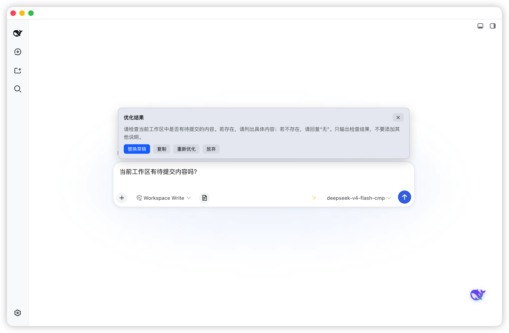

# dsh-prompt-optimizer

输入框 prompt 优化：一键把草稿润色为更清晰、更结构化的高质量 prompt（OpenAI 兼容 API，自配 Key）。



## ✨ 功能

- ✨ **一键优化**：输入栏右侧 ✨ 按钮，点击即以当前草稿生成优化结果；快捷键 `Alt+O`（焦点在输入框内时）等效触发
- 🖼️ **流式预览卡片**：结果边生成边滚入（v4 系列模型的推理过程也实时可见），完成后呈现「替换草稿 / 复制 / 重新优化 / 放弃」四个操作
- 🔄 **替换草稿**：优化结果一键写回输入框（React 受控组件原生感知），不满意可 `重新优化` 或 `放弃`
- 📋 **一键复制**：结果复制到剪贴板，1.2 秒「已复制」反馈
- 🌏 **双语界面**：文案跟随 DSH 语言（zh / en）实时切换
- ⚙️ **自配 API**：设置 → 通用设置 → Prompt 优化，填写接口地址、API Key、模型名
- 💾 **配置自持持久化**：`~/.dsh/prompt-optimizer-config.json`（loopback RPC 读写，不依赖宿主 settings 注册表）
- 🌓 **深色模式**：全部配色跟随 DSH 主题变量，深夜模式下按钮固定品牌蓝 + 白字，保证可读
- 🔒 **纯本地 Key**：API Key 仅存于本地配置文件，浏览器 fetch 直连你的 API，不经过任何第三方服务

## 📦 安装

```sh
dsh plugin --profile web add dsh-prompt-optimizer
```

等效（临时用官方 CLI）：

```sh
npx @deepseek-ai/dsh plugin --profile web add dsh-prompt-optimizer
```

本地目录开发方式：

```sh
dsh plugin --profile web add file:/path/to/dsh-prompt-optimizer
```

安装后重启 DSH（Web 或 Desktop）。

> **桌面 Desktop profile**：同样支持 `dsh plugin --profile desktop add dsh-prompt-optimizer`；
> 若此前以 `link:`（symlink）方式手工装配用于开发，保留 link: 即可实时同步工作区改动，无需改回 npm 版。

## ⚙️ 配置

在 **设置 → 通用设置 → Prompt 优化** 中填写：

| 字段 | 默认 | 说明 |
|---|---|---|
| 接口地址 | `https://api.deepseek.com` | 任意 OpenAI 兼容 `/chat/completions` 端点 |
| API Key | — | 你的密钥（需支持流式） |
| 模型名 | `deepseek-v4-flash` | 勾选「使用当前会话模型」（默认）时忽略此项 |

配置保存于 `~/.dsh/prompt-optimizer-config.json`（与 DSH 其他配置同目录，卸载插件时一并清理）。

> 接口需支持 CORS 与 SSE 流式（官方 DeepSeek / OneAPI 类网关均可）。

## 🏗️ 架构

- **client**（`dist/client.js`，经 `cordis.patch.yml` 装载）：输入槽位按钮 + 预览卡片 + 设置行；两种通道——
  - **会话默认模型（零配置，默认）**：走自有 RPC → 服务端真流式，不填任何 Key
  - **自配 OpenAI 兼容 API**：浏览器 `fetch` 直连（需支持 CORS 与 SSE）
- **server half**（`lib/index.js`）：配置持久化（读写 `~/.dsh/prompt-optimizer-config.json`，经 loopback RPC 通道 `/dsh-prompt-optimizer` 暴露 `get`/`set`）+ 宿主模型服务面——
  - `sessionModel`：经宿主 `agentDefaultModel` 取当前会话/agent 默认模型（provider + model，免配置）
  - `optimize.start / poll / abort`：经宿主 `llm.stream` 后台真流式，client 轮询增量呈现（近似流式）
  - 不用 `session.create/fork`：渲染进程无法让**后台**会话执行生成（自编 id 被静默拒绝、fork 子会话不在前台不触发模型，实测「永远正在优化」）
- **预览状态**：模块级事件总线（`preview-bus`），按钮 / 卡片 / 编排共享，不依赖会话 store 标准 props；预览窗口绑定发起会话（切走不跟随，切回恢复）

## 🔧 开发

```sh
npm run build   # esbuild 打包 dist/client.js
npm test        # 纯函数单测（node 运行 tests/entry.ts）
```

## 📄 License

MIT